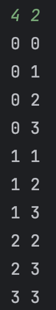
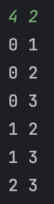

# 20240221

## 조합

조합이란 크기가 n인 집합 중 r개를 순서를 고려하지 않고 뽑는 것을 말한다.(단, n>=r) <br>
예를 들어 5개의 숫자 중 3개를 뽑을 때 [1, 2, 3]과 [2, 3, 1]은 같은 경우로 취급한다. <br>

**조합 공식**
>n
​
C
r
​
=C(n,r)
>=n! /r! (n−r)!
​

**중복조합 공식**
> n
​
H
r
​
=C(n+r−1,r)


코드에서 사용한 변수는 다음과 같다.

| 변수      | 용도                                                                                           |
|---------|----------------------------------------------------------------------------------------------|
| n       | 'n개의 숫자 중 r개의 숫자 중'에서 n에 해당함.                                                                |
| r       | 'n개의 숫자 중 r개의 숫자 중'에서 r에 해당함. 몇 개의 숫자를 뽑을지에 대한 변수. 재귀 호출에서 1씩 감소하고, 0일 때 결과를 출력하고 return 한다. |
| result  | 뽑힌 요소들을 담을 숫자형 배열.                                                                           |
| bucket  | n개의 집합 요소를 담은 숫자열 배열.                                                                            |
| index   | 현재 뽑힌 숫자의 index. 재귀를 호출할 때마다 1씩 늘어난다.(조합 코드에선 사용하지 않음)                                |
| start   | 현재 뽑힌 숫자의 index. 중복을 허용하지 않는 조합의 경우 다음 요소를 선택해야하므로 +1 늘어나야 한다.                               |
| visited | 중복이 허용되지 않는 조합에서 사용하는 배열. 방문 여부를 판별한다. 재귀가 끝난 후에는 다시 false로 원상복구해주어야한다.                      |

## 코드

재귀를 이용하는 방법, 백트래킹을 이용하는 방법이 있는데 나는 백트래킹을 이용하였다. 

### 중복조합

```java
import java.io.BufferedReader;
import java.io.InputStreamReader;
import java.util.StringTokenizer;

public class Main18 {

  // 중복조합
  static int n;
  static int[] result;

  static void combination(int[] bucket, int[] result, int start, int index, int n, int r) {

    if(r == 0) {
      for (int i = 0; i < index; i++) {
        System.out.print(result[i]+ " ");
      }
      System.out.println();
      return;
    }

    for(int i = start; i < n; i++) {
      result[index] = bucket[i];
      combination(bucket, result, i, index + 1, n, r - 1);
    }
  }


  public static void main(String[] args) throws Exception {

    BufferedReader br = new BufferedReader(new InputStreamReader(System.in));
    StringTokenizer st = new StringTokenizer(br.readLine());

    n = Integer.parseInt(st.nextToken());
    int r = Integer.parseInt(st.nextToken());
    result = new int[r];
    int[] bucket = new int[]{0, 1, 2, 3};

    combination(bucket, result, 0,0, n, r);
  }
}

```


n = 4, r = 2가 입력되었을 때 결과<br>



### 조합

```java
import java.io.BufferedReader;
import java.io.InputStreamReader;
import java.util.StringTokenizer;

public class Main17 {

  // 조합
  static void combination(int[] arr, boolean[] visited, int start, int n, int r) {

    if(r == 0) {
      for (int i = 0; i < n; i++) {
        if (visited[i]) {
          System.out.print(arr[i]+ " ");
        }
      }
      System.out.println();
      return;
    }

    for(int i = start; i < n; i++) {
      visited[i] = true;
      combination(arr, visited, i + 1, n, r - 1);
      visited[i] = false;
    }
  }


  public static void main(String[] args) throws Exception {

    BufferedReader br = new BufferedReader(new InputStreamReader(System.in));
    StringTokenizer st = new StringTokenizer(br.readLine());

    int n = Integer.parseInt(st.nextToken());
    int r = Integer.parseInt(st.nextToken());
    boolean[] visited = new boolean[n];
    int[] bucket = new int[]{0, 1, 2, 3};

    combination(bucket, visited, 0, n, r);
  }
}

```

n = 4, r = 2가 입력되었을 때 결과<br>


