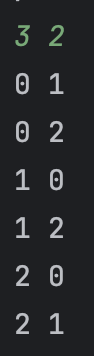

# 20240220

## 순열 

순열이란 n개의 숫자 중 r개의 숫자를 순서를 고려하여 뽑는 것을 말한다. 
예를 들어 5개의 숫자 중 3개를 뽑을 때 [1, 2, 3]과 [2, 3, 1]은 다른 경우로 취급한다. <br>

코드에서 사용한 변수는 다음과 같다. 

| 변수      | 용도                                                                                               |
|---------|--------------------------------------------------------------------------------------------------|
| n       | 'n개의 숫자 중 r개의 숫자 중'에서 n에 해당함. 내 소스코드에선 0~n-1개의 숫자이다.                                             |
| r       | 'n개의 숫자 중 r개의 숫자 중'에서 r에 해당함. 몇 개의 숫자를 뽑을지에 대한 변수.                                               |
| bucket  | 뽑힌 숫자들을 담을 숫자형 배열.                                                                               |
| index   | 현재 뽑힌 숫자의 bucket index. 재귀를 호출할 때마다 1씩 늘어나고, bucket의 length와 같다면 배열을 출력하고 return한다               |
| visited | 중복이 허용되지 않는 순열에서 사용하는 배열. 넣고자 하는 숫자를 인덱스로 사용하여 방문 여부를 표시한다. 재귀가 완전히 끝난 후에는 다시 false로 원상복구해주어야한다. |

## 코드


### 중복순열
```java
import java.io.BufferedReader;
import java.io.InputStreamReader;
import java.util.Arrays;
import java.util.StringTokenizer;

public class Main15 {

  // 중복순열
  static int n;
  static Integer[] bucket;

  public static void pick(int index) {
    
    if (index == bucket.length) {
      Arrays.stream(bucket).forEach(i -> System.out.print(i+" "));
      System.out.println();
      return;
    }

    for (int i = 0; i < n; i++) {
      bucket[index] = i;
      pick(index + 1);
    }

  }
  public static void main(String[] args) throws Exception {

    BufferedReader br = new BufferedReader(new InputStreamReader(System.in));
    StringTokenizer st = new StringTokenizer(br.readLine());

    n = Integer.parseInt(st.nextToken());
    int r = Integer.parseInt(st.nextToken());
    bucket = new Integer[r];

    pick(0);

  }

}
```


n = 4, r = 2가 입력되었을 때 결과<br>


### 순열 

```java
import java.io.BufferedReader;
import java.io.InputStreamReader;
import java.util.Arrays;
import java.util.StringTokenizer;

public class Main16 {

  // 순열
  static int n;
  static Integer[] bucket;
  static boolean[] visited;

  public static void pick(int index) {

    if (index == bucket.length) {
      Arrays.stream(bucket).forEach(i -> System.out.print(i+" "));
      System.out.println();
      return;
    }

    for (int i = 0; i < n; i++) {
      if (!visited[i]) {
        visited[i] = true;
        bucket[index] = i;
        pick(index + 1);
        visited[i] = false;
      }
    }
  }


  public static void main(String[] args) throws Exception {

    BufferedReader br = new BufferedReader(new InputStreamReader(System.in));
    StringTokenizer st = new StringTokenizer(br.readLine());

    n = Integer.parseInt(st.nextToken());
    int r = Integer.parseInt(st.nextToken());
    visited = new boolean[n];
    bucket = new Integer[r];

    pick(0);

  }
}
```

n = 3, r = 2가 입력되었을 때 결과<br>




