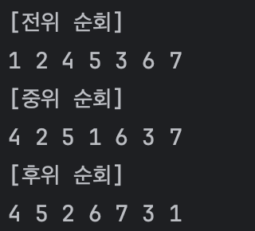

# 20240319

# 트리(Tree)

- 트리는 계층적인 구조를 가지는 자료구조이다.
- 한 개 이상의 유한집합이다.

## 용어

### 구성요소

- 노드 : 트리의 구성요소
- 간선 : 노드를 연결하는 연결선
- 루트 : 계층적인 구조에서 가장 높은 곳에 있는 하나의 노드
- 서브 트리 : 루트를 제외한 노드 집합
- 차수 : 자식 노드의 개수
- 트리의 차수 : 트리가 가지고 있는 노드의 차수 중 가장 큰 차수
- 레벨 : 각층에 번호를 매긴 것이다. 보통 루트가 1이고, 하위로 갈 수록 1씩 증가한다.

### 관계에 의한 노드 용어

- 부모 노드 : 간선으로 연결된 노드 중 윗계층에 있는 노드
- 자식 노드 : 간선으로 연결된 노드 중 아래 계층에 있는 노드
- 형제 관계 : 같은 부모 노드를 가진 노드. 같은 계층에 있다.
- 조상 노드 : 루트 노드에서 해당 노드까지의 경로를 이루고 있는 노드들
- 후손 노드 : 어떤 노드의 서브트리에 속하는 노드

### 노드 용어
- 차수 : 자식 노드의 개수
- 트리의 차수 : 트리가 가지고 있는 노드의 차수 중 가장 큰 차수
- 레벨 : 각층에 번호를 매긴 것이다. 보통 루트가 1이고, 하위로 갈 수록 1씩 증가한다. 

## 트리의 종류 - 이진트리

- 트리의 종류에는 일반트리와 이진트리가 있다. 이 중 보통 이진트리가 보편적으로 쓰인다. 
- 공집합도 이진트리이다. 

### 이진트리의 특징
- 노드의 차수가 2 이하이다. 
- 서브 트리간 순서가 존재한다. 왼쪽 노드, 오른쪽 노드로 구분되며 보통 왼쪽을 먼저 생각한다. 
- n개의 노드가 있다면 n-1개의 간선이 있다. 
- 높이가 h인 이진트리라면, 노드는 h개 ~ (2^h - 1)개이다. 

포화 이진트리, 완전 이진트리가 있다.
포화 이진트리는 단말 노드를 제외한 모든 노드의 차수가 2인 트리를 말한다. 즉, 단말 노드를 제외한 모든 노드가 2개의 자식 노드를 가지고 있다. 
완전 이진트리는 높이가 h라면 h-1층까지는 포화 이진트리이고, h층에서는 왼쪽에서 오른쪽까지 순서대로 채워져있는 트리를 말한다. 


## 이진 트리 JAVA로 순회 구현하기

트리에는 **전위, 중위, 후위 순회**가 있다. 
노드를 V, 왼쪽 자식 노드를 L, 오른쪽 자식 노드를 R이라고 했을 경우 방법에 따른 방문 순서는 다음과 같다. 

>전위 순회 : VLR

>중위 순회 : LVR

>후위 순회 : LRV

순회는 재귀로 구현하면 쉽게 구현가능하다. 


우선 이진트리의 노드는 JAVA로 다음과 같이 구현할 수 있다.
Node가 가지는 구성요소는 왼쪽 자식, 오른쪽 자식, 해당 노드가 가지는 값이다. 
자식이 없을 경우 null을 넣어주면 된다. 

```java
public class Node {
  private Node left;
  private Node right;
  private int value;


  public Node(Node left, Node right, int value) {
    this.left = left;
    this.right = right;
    this.value = value;
  }

  public Node getLeft() {
    return left;
  }
  public Node getRight() {
    return right;
  }
  public int getValue() {
    return value;
  }
}
```

**class를 이용한 node 생성 예시**
```java
    Node childNode04= new Node(null, null, 4);
    Node childNode05= new Node(null, null, 5);
    Node childNode06= new Node(null, null, 6);
    Node childNode07= new Node(null, null, 7);

    Node childNode02= new Node(childNode04, childNode05, 2);

    Node childNode03= new Node(childNode06, childNode07, 3);

    Node rootNode= new Node(childNode02, childNode03, 1);
    
    System.out.println("[전위 순회]");
    preOrder(rootNode);

    System.out.println();
    System.out.println("[중위 순회]");
    inOrder(rootNode);

    System.out.println();
    System.out.println("[후위 순회]");
    postOrder(rootNode);
```

그리고 이 class를 이용해 아래와 같이 노드를 생성하면, 다음과 같은 구조의 트리가 생성된다.

        1
       / \
      2   3
     / \ / \
    4  5 6  7


이러한 구조로 형성된 트리로 재귀를 이용해 전위, 중위, 후위순회를 구현하였다.

#### 전위 순회
```java
public static void preOrder(Node node) {
  if (node != null) {
    System.out.print(node.getValue()+" ");
    preOrder(node.getLeft());
    preOrder(node.getRight());
  }
}
```

#### 후위 순회
```java
public static void postOrder(Node node) {
  if (node != null) {
    postOrder(node.getLeft());
    postOrder(node.getRight());
    System.out.print(node.getValue()+" ");
  }
}
```


#### 중위 순회
```java
public static void inOrder(Node node) {
  if (node != null) {
    inOrder(node.getLeft());
    System.out.print(node.getValue()+" ");
    inOrder(node.getRight());
  }
}
```

#### 순회 코드 실행 결과


