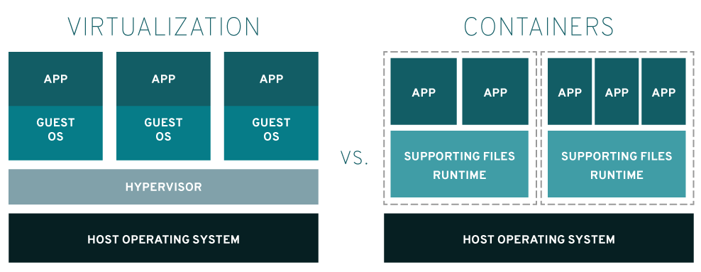

# 20240226

# Docker

> 아래 영상을 보고 정리하였습니다. 
> [도커 한방에 정리 🐳 (모든 개발자들이 배워보고 싶어 하는 툴!) + 실습](https://youtu.be/LXJhA3VWXFA?si=wnbdE9LAJIwKgq1j)
- Stackoverflow에서 조사한 결과, 개발자들이 git 다음으로 가장 많이 사용한 툴로 조사되었다. Docker란 무엇일까?

## Docker란?

- 어플리케이션을 패키징할 수 있는 툴을 말한다.

### Problem
- 개발자의 pc 환경, 서버의 pc환경이 다른 경우
- 사용하는 툴의 버전 등이 다르다면 이슈가 터졌을 때 문제점을 잡기 어렵다. 

### Solution
- Docker의 컨테이너 안에 어플리케이션 뿐만 아니라 시스템 툴, 라이브러리, 프레임워크에 대한 정보, 환경변수 등을 넣는다.
- 어플리케이션을 구동하기 위한 런타임 환경에 필요한 모든 것들을 어떤 PC에서도 동일하게 구동할 수 있다. 
- 이것저것 설정해야하는 번거로움을 덜어준다. 

## Container VS VM

[AWS 공식 문서]( https://aws.amazon.com/ko/compare/the-difference-between-containers-and-virtual-machines/)에서도 이 둘의 차이점을 친절하게 설명해주고 있다. 

이미지 출처 : 
[RED DHAT 공식사이트](https://www.redhat.com/ko/topics/containers/containers-vs-vms)

### VM
- VM은 가상머신으로, 한 OS안에서(단일 물리적 서버) 동일한 어플리케이션을 여러가지 환경(서로 다른 OS)에서 구동시킬 수 있다
- VM은 각각의 고립된 환경이 운영체제를 포함하고 있기 때문에 무겁고, 시작하는데 시간이 오래 걸리고, 리소스를 많이 사용한다는 단점이 있다. 

### Container
- 컨테이너는 애플리케이션의 코드, 라이브러리 및 기타 종속 구성 요소를 포함하는 sw 코드 패키지이다. 
- 컨테이너는 여러 환경에서 예측 가능하고 반복 가능한 방식으로 애플리케이션을 패키징하고 실행하기 위해 개발되었다. 

## 공통점
- 애플리케이션을 IT 인프라 리소스로부터 독립적으로 만드는 기술이다. 
- 모두 배포 기술이다. 

## 차이점 
- **VM이 경량화된 개념이 Container이다. Container은 가볍다.**

- 호스트 OS 위에 Container Engine을 설치만 하면 개별적인 컨테이너에서 고립된 환경에서 각각의 애플리케이션을 구동할 수 있다.

- **VM의 어플리케이션은 운영체제(OS)를 포함하지만, Container는 운영체제를 포함하지 않는다.**

- 컨테이너가 구동되기 위해선 Cotainer Engine이 필요하고, 이 Engine이 Host Os에 접근해서 필요한 것을 처리한다.
- **여기서 Container Engine 중 가장 많이 쓰이는게 Docker이다.**
---

## Docker의 3대 구성 요소
1. Dockerfile
2. Image
3. Container

### Dockerfile
- Docker을 구동하기 위한 설명서로, 일종의 요리 레시피라고 사용하면 된다.
- 꼭 필요한 파일은 무엇이 있는지, 사용해야하는 프레임워크나 라이브러리, 필요한 환경변수 등등에 대한 내용을 담고 있다. 

### Image
Dockerfile을 기반으로 Image를 만든다. 
- 애플리케이션을 실행하기 위한 모든 셋팅들이 포함되어 있다.
- 실행되고 있는 어플리케이션의 상태의 스냅샷을 만들어 Image를 만든다. 
- 불변의 상태이다.
- 객체 지향에서 Class에 해당된다고 생각하면 된다. 

### Container

- Image를 고립된 환경에서 실행할 수 있다.
- 컨테이너 안에서 어플리케이션을 구동시킨다.
- 객체 지향에서 instance에 해당된다고 생각하면 된다.

## 동작

1. 내 로컬 컴퓨터에서 docker, 그리고 서버에 docker을 설치한다.
2. dockerfile을 작성하여 image를 build한다. → 어플리케이션의 스냅샷을 만든다.
3. image를 Container Registry에 push하면 server에서 pull받아 docker container에서 run한다.
