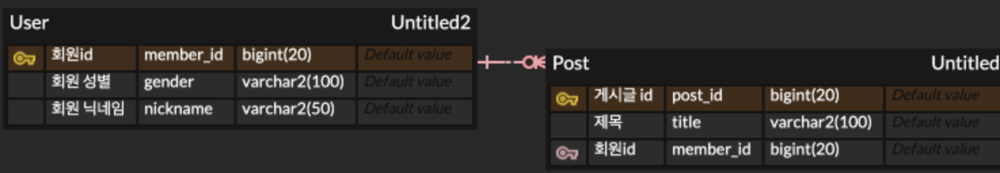
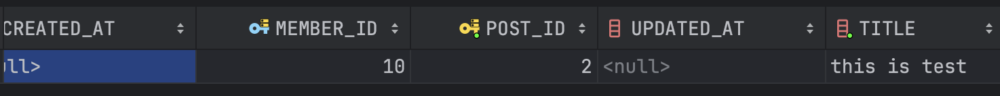

# 20240312 


## JPA 양방향 매핑 - CasCade

양방향 매핑의 데이터 삽입, 수정, 삭제에 관하여 너무 헷갈려서 공부하는 글..ㅜㅜ
내 궁금점은 `단순히 양방향 매핑된 필드에 접근하여서 상대의 데이터를 수정, 삭제, 삽입할 수 있을까` 였다. 

ERD, 엔티티 설계는 다음과 같다.



### Member.java
```java
@Entity
@Getter
@Builder
@NoArgsConstructor(access = AccessLevel.PROTECTED)
@AllArgsConstructor
public class Member extends BaseEntity {

@Id
@Column(name="member_id")
@GeneratedValue(strategy = GenerationType.IDENTITY)
private Long memberId;

@Enumerated(EnumType.STRING)
@Column(nullable = false)
private Gender gender;

@Column(nullable = false)
private String nickname;

@OneToMany(mappedBy = "member")
List<Post> postList = new ArrayList<Post>();

public void addPostList(Post post) {
if (this.postList == null) {
this.postList = new ArrayList<>();
}
this.postList.add(post);
}

}
```

### Post.java

```java
@Entity
@Getter
@Builder
@NoArgsConstructor(access = AccessLevel.PROTECTED)
@AllArgsConstructor
public class Post extends BaseEntity{

  @Id
  @Column(name="post_id")
  @GeneratedValue(strategy = GenerationType.IDENTITY)
  private Long memberId;

  @Enumerated(EnumType.STRING)
  @JoinColumn(name = "member_id")
  @ManyToOne
  private Member member;

  @Column(nullable = false)
  private String title;

  public void addMember(Member member) {
    this.member = member;
    member.getPostList().add(this);
  }

}
```


## Member의 postList에 접근하여 post를 저장 -> 실패
```java
@Test
@Transactional
@Rollback(false)
public void testInsert() throws Exception {

    // Member의 postList 필드에 접근하여 추가하였을 때, DB Post에도 저장이 되는지 test

    Member newMember = Member.builder().gender(Gender.FEMALE).nickname("TEST").build();
    memberRepository.save(newMember);

    Long newMemberId = newMember.getMemberId();
    Member findMember = memberRepository.findById(newMemberId)
    .orElseThrow(() -> new Exception("해당 Member 없음"));

    Post newPost = Post.builder().member(findMember).title("this is test").build();
    findMember.addPostList(newPost);

    assertThat(findMember.getPostList().size()).isEqualTo(1);

    }
```
우선 위의 엔티티 설계 코드대로 엔티티를 설계한 뒤 test 코드 후에 newPost는 DB에 저장되지 않는다. `필드에 접근한다고 newPost가 영속화되는게 아니기 때문`이다..! 

만약 의도한대로 newPost가 DB에 저장되게 하려면, `findMember.addPostList(newPost);`에서 접근한 시점에서 newPost를 영속화하여 영속성 컨텍스트에 올려야한다. 

그럴 때 사용하는 것이 `CasCade` 설정이다. CasCade는 부모 엔티티를 변경할 때 자식 엔티티에도 자동으로 반영되게 하는 것을 말한다. 

## CasCade의 옵션

`PERSIST`: 부모 엔티티가 저장될 때 연관된 엔티티를 저장한다. 부모가 영속화될 때 자식도 함께 영속화 된다. 

`MERGE`: 부모 엔티티가 병합될 때 연관된 엔티티도 병합된다.

이하 옵션들도 모두 부모 엔티티가 변경될 때 자식 엔티티가 변경되는 것이라고 생각하면 된다.

`REMOVE`: 삭제

`REFRESH`: 새로고침

`DETACH`: 분리

`REPLICATE`: 복제

`LOCK`: 잠김

그리고 이 모든 것을 한번에 적용하는 `ALL` 옵션이 있다. 

## CasCade 적용

Member의 postList에 Cascade 설정을 걸어본 뒤 다시 test 코드를 돌려보았다.

```java
@OneToMany(mappedBy = "member", cascade = CascadeType.ALL)
List<Post> postList = new ArrayList<Post>();
```

실행시키니 아래와 같이 DB에 잘 적용되었음을 확인할 수 있었다. 


## 결론
이렇게 CasCade는 단순히 한 엔티티에만 접근해서 다른 엔티티까지 변경할 수 있다는 장점이 있다. 
그러나 부모와 자식 엔티티의 의존성이 증가하고, 잘못 설정해서 의도치않게 데이터를 삭제시켜버릴 수 있다는 단점이 있다.

그러므로 자식이 한 부모에만 의존하고 있다는 것이 분명한 경우에만 사용하는 것이 좋아보이고, 내 코드에 대한 정확한 이해가 필수적인 것 같다. 

또한 이러한 내용은 JPA의 `영속성 컨텍스트`에 대한 이해가 중요해보인다.. 해당 엔티티가 JPA에 의해 관리되고 있는 상태여야 DB 반영이 되기 때문이다. 
공부를 제대로 하지 않으면 부모만 변경해놓고서 자식도 변경되었다고 착각할 수 있을 것 같다.(내가 그랬음)


